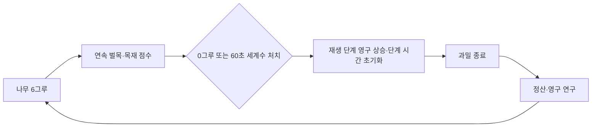

# 벌목 기록 모드 메타 루프 v1

## 핵심 반복

**저장된 재생 단계에서 나무 6그루로 시작해 쉬지 않고 벌목하고, 로비 영구 연구로 현재 단계의 벽을 넘는다.**

1. 활성 나무 6그루에서 작업을 시작한다.
2. 직접 착화하고 목재를 벌목 점수와 수종별 정산 재고로 누적한다. 인게임 선택 화면은 열리지 않는다.
3. 산림 공급은 저장된 영구 재생 단계에서 시작한다. 현재 나무를 0그루로 만들면 즉시 승급한다. 0그루를 못 만들더라도 해당 단계에서 60초를 버티면 세계수가 솟고, 세계수를 쓰러뜨리면 승급한다. 두 경로 모두 즉시 저장되며 다음 판도 저장된 단계에서 시작한다.
4. 재생 속도는 `0.14 × 1.75^(단계-1) × 2^(단계 시간/30초)`, 나무 HP는 `1.03^(단계-1)`로 올라간다. 승급하면 단계 시간과 시간 압력이 ×1로 초기화된다. 0그루 승급은 6그루를 다시 심고, 세계수 승급은 살아 있는 현재 숲을 유지한다.
5. 무기·동료·운영 성장은 로비 영구 연구에서만 구매한다.
6. 활성 나무가 허용량에 닿으면 즉시 종료한다.
7. 버틴 시간, 총 벌목과 최고 재생 단계를 정산하고, 수종별 목재 기본 가치에 ×2를 적용해 연구 코인으로 바꾼다.
8. 영구 전투 연구를 구매하고 저장된 재생 단계에서 다음 작업을 시작한다.

## 영구 성장과 런 기록

| 성장 | 유지 범위 | 역할 |
|---|---|---|
| 목재 점수·수종 재고 | 현재 런 | 벌목 기록과 결과 연구 코인 정산 |
| 연구 코인 특성 | 런 사이 | 무기·동료·운영 세부 수치와 나무 허용량 |
| 재생 단계 | 영구 | 다음 런의 시작 공급 속도와 완만한 나무 HP 보정 |

한 그루의 목재는 실제 벌목량과 수종별 정산 재고로 기록된다. 런 중 경험치나 별도 자동화 설비 구매에 소비하지 않는다. 업적 포인트는 업적 전용 재화로 분리한다.

### 연구 비용 상승률

노드에 적힌 비용은 **기준가**다. 실제 가격은 이미 구매한 기록 모드 랭크 수에 따라 `기준가 × 1.008^(보유 랭크)`로 오른다. 288랭크를 전부 사면 마지막 노드는 기준가의 약 9.8배가 되고, 트리 총액은 35,337에서 200,534코인이 된다.

이유는 수입 쪽이 지수이기 때문이다. 공급이 30초마다 두 배가 되므로 처리량이 오르면 판당 벌목량이 그에 비례해 늘고, 재생 단계 수입 배수까지 겹친다. 반면 손으로 적은 노드 가격은 트리 전체에서 6배도 벌어지지 않아서, **진행 90% 지점의 노드가 시작 지점보다 "판 수" 기준으로 오히려 6배 싸지는 역전**이 있었다. 후반에는 한 판 수입으로 노드를 여덟 개씩 살 수 있었고 트리가 순식간에 녹았다.

배율은 노드별 깊이가 아니라 **보유 랭크 총수**에 걸린다. 어느 시점에서든 후보 전체에 같은 배율이 붙으므로 "가장 싼 것부터"라는 구매 순서와 손으로 잡아 둔 노드별 상대 가격이 그대로 보존되고, 바뀌는 것은 곡선의 기울기뿐이다. 1.008에서 노드 하나를 사는 데 드는 판 수가 진행 내내 거의 평평해지고(0.031 → 0.033) 마지막 노드만 0.6판짜리 목표로 남는다.

보존된 캐릭터 트리(`scoreMode`가 아닌 노드)는 별도 경제이므로 상승률을 받지 않는다. 구현은 `CharacterTraits.RESEARCH_ESCALATION`과 `CharacterTraits:nodeCost`이며, 회귀 검사는 `scripts/verify_character_traits.lua`에 있다.

## 선택 구조

전투 성능은 로비에서 투척 거리·착화 반경·착화 확률·확산량·흡연/비행/연소 속도처럼 작은 특성을 갈래별로 구매한다. 아기 로봇·작업장·나무 허용량 같은 운영 효과도 같은 영구 연구판에서 구매한다. 활성 기록 모드에는 런 드래프트가 없고, 일반 작전의 카드 정의만 향후 복구용으로 보존한다.

## 목표 런 길이

| 진행 구간 | 목표 런 길이 |
|---|---:|
| 첫 1~2회 | 15~30초 |
| 3~5회 | 35~60초 |
| 6~10회 | 60~120초 |
| 중반 | 2~4분 |
| 후반 | 4~6분 |

강한 빌드는 0그루를 달성해 다음 영구 단계로 올라간다. 종료 원인은 나무 한 그루가 지나치게 단단해서가 아니라, 저장된 단계의 재생 물량을 더는 따라잡지 못한 결과여야 한다.

## 완료 판정

- 첫 목재부터 벌목 점수와 수종별 재고만 증가한다.
- 아무리 많은 목재를 한꺼번에 얻어도 XP·레벨·선택 대기열이 증가하지 않는다.
- 과거 테스트 상태에 대기 중 강화가 남아 있어도 선택 화면을 열지 않고 즉시 폐기한다.
- 자동화 구매 HUD와 단축키가 남아 있지 않다.
- 기록 모드의 강화 후보 풀은 항상 비어 있고 모든 활성 성장은 영구 연구에만 둔다.
- 전투 카드·3레벨 분기·6레벨 진화·융합 코드는 일반 작전과 연습장에 보존한다.
- 결과에서 최고 재생 단계와 최고 생산력을 확인할 수 있다.
